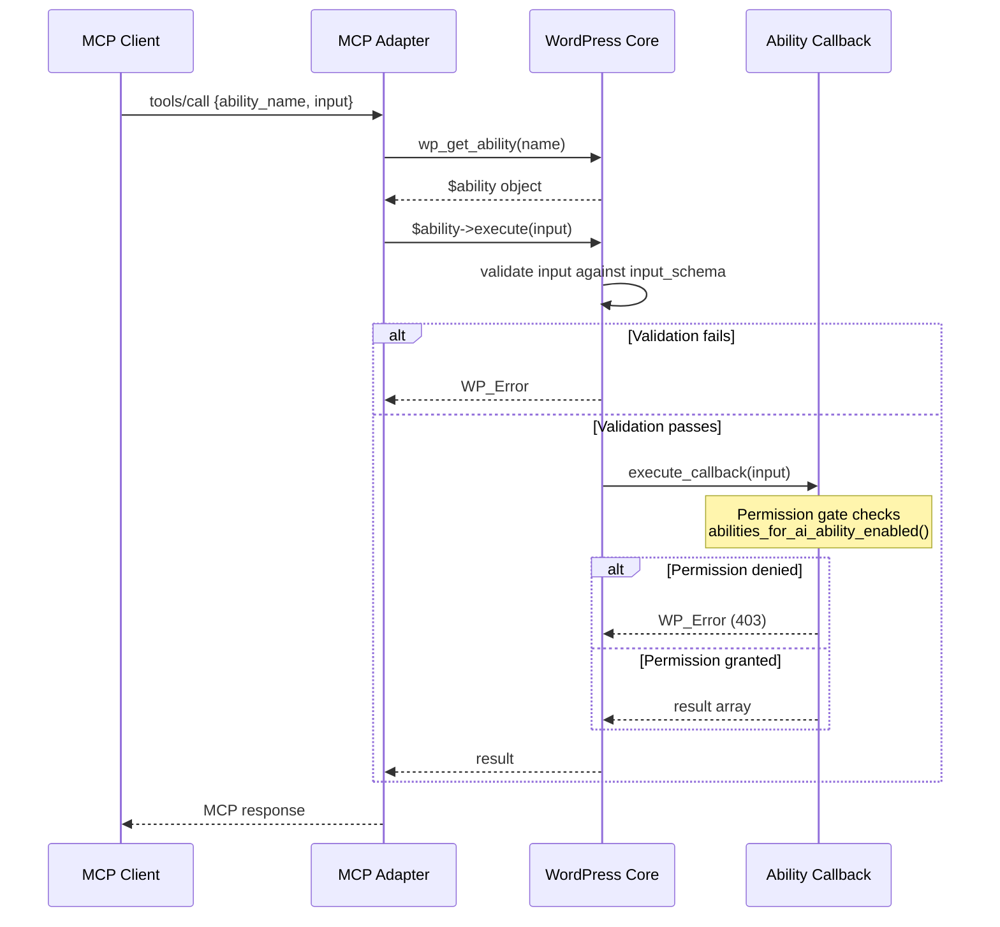

# Abilities API Architecture

How `wp_register_ability()` works, the Registrar convenience layer, schema validation, and execution flow.

## Registration

All abilities register on the `wp_abilities_api_init` hook. This is the **only** hook that works — registering on any other hook silently fails because the abilities registry isn't initialized yet.

### Direct Registration (WordPress Core API)

```php
add_action( 'wp_abilities_api_init', function() {
    wp_register_ability( 'namespace/ability-name', array(
        'label'               => 'Human-readable name',
        'description'         => 'What this ability does',
        'category'            => 'registered-category-slug',
        'execute_callback'    => 'my_callback_function',
        'permission_callback' => function() {
            return current_user_can( 'edit_posts' );
        },
        'input_schema'        => array(
            'type'       => 'object',
            'properties' => array(
                'param_name' => array(
                    'type'        => 'string',
                    'description' => 'What this param is',
                ),
            ),
            'required' => array( 'param_name' ),
        ),
        'meta' => array(
            'show_in_rest' => true,
            'annotations'  => array(
                'readonly'    => true,
                'destructive' => false,
                'idempotent'  => true,
            ),
        ),
    ) );
} );
```

Note: the callback key is `execute_callback`, not `callback`. This matches WordPress core's API.

### The Registrar (Convenience Layer)

Most abilities in our suite use the Registrar class (`WickedEvolutions\AbilitiesForAI\Core\Registrar`) instead of calling `wp_register_ability()` directly. The Registrar auto-injects annotations, permission callbacks, tier gating, and REST visibility.

**Source:** `src/Core/Registrar.php`

```php
add_action( 'wp_abilities_api_init', function() {
    $reg = new Abilities_For_AI_Registrar( 'content', 'edit_posts' );

    // Read: readonly=true, destructive=false, idempotent=true, tier=free
    $reg->read( 'content/list', array(
        'label'        => 'List Content',
        'description'  => 'List posts, pages, and custom post types',
        'input_schema' => array( /* ... */ ),
        'callback'     => function( $input ) { /* ... */ },
    ) );

    // Write: readonly=false, destructive=false, idempotent=true, tier=pro
    $reg->write( 'content/create', array( /* ... */ ) );

    // Delete: readonly=false, destructive=true, idempotent=true, tier=pro
    $reg->delete( 'content/delete', array( /* ... */ ) );
} );
```

**Constructor:** `new Registrar( $module, $capability )`
- `$module` — category slug (e.g., `'content'`), used as default category and for permission lookups
- `$capability` — WordPress capability required (e.g., `'edit_posts'`)

**What the Registrar adds automatically:**
1. **Annotations** — `readonly`, `destructive`, `idempotent`, `permission` based on read/write/delete method
2. **Permission callback** — `current_user_can( $capability )`
3. **Per-ability permission gate** — wraps callback to check `abilities_for_ai_ability_enabled()` at execution time, returns `WP_Error` (403) if disabled
4. **Pro tier gate** — write and delete default to `tier: pro`, wrapped with `abilities_for_ai_pro_gate()`
5. **No-input safety** — wraps callbacks so abilities without `input_schema` don't fatal on zero arguments
6. **REST visibility** — `show_in_rest: true` and `mcp.public: true` on all abilities

## Execution Flow



The Adapter calls `wp_get_ability($name)` to get the ability object, then `$ability->execute($input)`. There is no `wp_execute_ability()` function — execution goes through the ability object directly.

## Name Format

WordPress core (WP 6.9+) supports 2-4 segments:
```
^[a-z0-9-]+(?:\/[a-z0-9-]+){1,3}$
```

All our abilities use 2-segment naming: `content/list`, `cache/flush-page-cache`, `fluent-crm/list-contacts`.

## Categories

Every ability belongs to a registered category. Categories must be registered **before** abilities that reference them.

```php
wp_register_ability_category( 'content', array(
    'label'       => __( 'Content Management', 'abilities-for-ai' ),
    'description' => __( 'Create, read, update, and delete WordPress content' ),
) );
```

WordPress silently drops abilities whose category slug doesn't match a registered category. No error, no log.

## Annotations

Annotations in `meta.annotations` control HTTP method mapping in the REST API:
- `readonly: true` → GET
- `destructive: true, idempotent: true` → DELETE
- Everything else → POST

The Registrar auto-sets these based on which method you call (`read()`, `write()`, `delete()`). It also adds a `permission` annotation matching the operation type.

## Permission Gating

Two layers of permission control:

### Layer 1: WordPress Capability
The `permission_callback` checks `current_user_can($capability)`. This runs before the ability executes.

### Layer 2: Abilities for AI Permission Toggles
The Registrar wraps every callback with `abilities_for_ai_ability_enabled()` check. This is a runtime check inside the callback, not at registration time — the ability always registers, but may return `WP_Error` (403) when called.

**Resolution order** (from `helpers.php`):
1. Per-ability override (`_overrides` in the `abilities_for_ai_permissions` option) — wins if set
2. Module-level permission — fallback

**Defaults:** 24 modules, most with read=ON, write=ON, delete=OFF. Site-health and REST are read-only modules.

## Schema Gotchas

### Empty Properties
Abilities with no input parameters must **omit** the `input_schema` key entirely. Using `'properties' => (object) array()` fails WordPress core's schema validator silently.

### Silent Category Validation
If the category slug in an ability registration doesn't match a registered category, WordPress drops the ability without any error or log entry. Always register categories before abilities.
