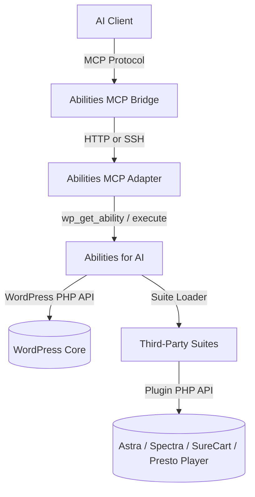
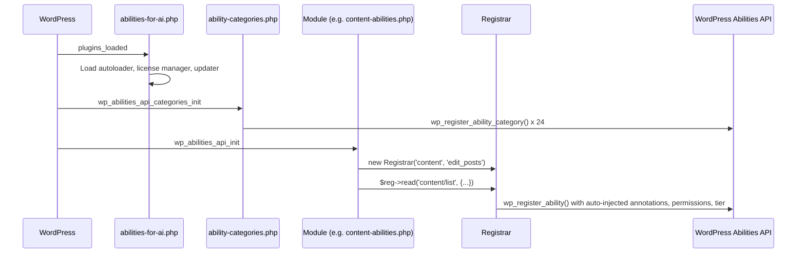
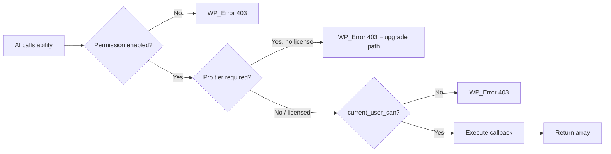

# Plugin Architecture

How Abilities for AI is structured internally — module loading, the Registrar, Knowledge Layer, third-party suites, and the security model.

## Where It Sits in the Stack



This plugin is the **provider** — it registers abilities that the Adapter exposes and the Bridge delivers. It doesn't handle MCP protocol, transport, or session management. Those are the Adapter's and Bridge's responsibilities.

## Directory Structure

```
abilities-for-ai/
├── abilities-for-ai.php      # Bootstrap — constants, autoloader, updater, hooks
├── includes/
│   ├── content-abilities.php  # Module: content CRUD
│   ├── blocks-abilities.php   # Module: block editor operations
│   ├── user-abilities.php     # Module: user management
│   ├── ...                    # 17 more core modules
│   ├── ability-categories.php # Category registration (runs before abilities)
│   ├── permissions.php        # Module toggle defaults + per-ability overrides
│   ├── helpers.php            # Shared utilities (safe_value, schema helpers)
│   ├── license-manager.php    # FluentCart license validation
│   ├── tier-gate.php          # Pro/free tier enforcement
│   ├── updater/               # FluentCart + GitHub Releases auto-update
│   └── suites/                # Third-party plugin integrations
│       ├── astra/
│       ├── spectra/
│       ├── surecart/
│       └── presto-player/
├── src/
│   └── Core/
│       └── Registrar.php      # Ability registration convenience layer
├── admin/
│   ├── dashboard.php          # Abilities Explorer + License tabs
│   └── kl/                    # Knowledge Layer Vue SPA (built assets)
├── knowledge/                 # Seed .md files for the Knowledge Layer
├── docs/                      # This documentation
└── vendor/                    # Composer autoloader (PSR-4)
```

## Module Loading

Each module is a standalone PHP file in `includes/` that registers abilities on the `wp_abilities_api_init` hook. The bootstrap file (`abilities-for-ai.php`) loads them via `require_once`.



Categories register first (on `wp_abilities_api_categories_init`), then abilities register on `wp_abilities_api_init`. This ordering is enforced by WordPress — abilities with unregistered categories are silently dropped.

## The Registrar

`src/Core/Registrar.php` is the convenience layer over `wp_register_ability()`. Every module uses it.

**What it auto-injects:**

| Method | readonly | destructive | idempotent | tier | permission |
|--------|----------|-------------|------------|------|------------|
| `$reg->read()` | true | false | true | free | read |
| `$reg->write()` | false | false | true | pro | write |
| `$reg->delete()` | false | true | true | pro | delete |

**Callback wrapping chain:**



The Registrar wraps every callback with permission checks and tier gates at registration time. The ability always registers (always discoverable), but may return `WP_Error` at execution time.

See [Abilities API Architecture](abilities-api-architecture.md) for the full registration and execution reference.

## Third-Party Suite Loader

The `includes/suites/` directory contains self-contained integrations for third-party WordPress plugins. Each suite has a `loader.php` that gates on plugin presence:

```php
// includes/suites/surecart/loader.php
if ( ! defined( 'SURECART_PLUGIN_FILE' ) ) {
    return; // Zero cost if SureCart isn't installed
}
require_once __DIR__ . '/product-abilities.php';
require_once __DIR__ . '/order-abilities.php';
// ...
```

The suite loader in `abilities-for-ai.php` scans for these automatically — drop in a new suite directory with a `loader.php` and it's picked up on the next load.

See [docs/suites/](suites/) for the complete ability lists per suite.

## Knowledge Layer

A database-backed system that gives AI agents persistent memory on a WordPress site.

**Database tables** (created on activation):

| Table | Purpose |
|-------|---------|
| `kl_documents` | Long-term knowledge storage (skills, style guides, site identity) |
| `kl_sessions` | AI interaction logs for session continuity |
| `kl_observations` | Technical findings discovered during diagnostics |
| `kl_meta` | Key-value metadata for documents |
| `kl_revisions` | Document version history |
| `kl_tags` | Tagging system for documents |
| `kl_taggables` | Tag-to-document relationships |

**Admin UI:** Vue 3 SPA at `admin/kl/` with documents, sessions, observations, tags, and a publish flow pipeline.

**Seed system:** On activation, the KL creates starter documents from `knowledge/*.md` files (getting-started, gutenberg-blocks, fluent-crm). These are locked and cannot be deleted.

## Security Model

Four layers, fail-closed at every level:

| Layer | What it checks | Failure |
|-------|---------------|---------|
| **Transport** | Basic Auth (HTTP) or SSH key | Connection rejected |
| **WordPress Capability** | `current_user_can($capability)` per module | WP_Error 403 |
| **Permission Toggle** | Per-module R/W/D toggles in admin dashboard | WP_Error 403 "ability_disabled" |
| **Schema Validation** | Input validated against JSON Schema before callback fires | WP_Error "invalid_input" |

**Defaults:** Read and Write ON, Delete OFF for all modules. Site Health and REST Discovery are read-only modules.

**Per-ability overrides:** The admin dashboard allows overriding module-level permissions on individual abilities. Override wins over module default.

## License and Tier Gating

**Free tier:** All read abilities + a controlled write round-trip (create + delete) for proof of competence.

**Pro tier:** Write and delete abilities that modify production state.

All abilities are registered and discoverable regardless of license. Pro abilities return a clear 403 with context at execution time — no hidden capabilities.

License validation uses FluentCart API with 24-hour cache and 7-day grace period.

## Related

- [Abilities API Architecture](abilities-api-architecture.md) — `wp_register_ability()` internals
- [Getting Started](getting-started.md) — installation and onboarding
- [Glossary](glossary.md) — key terms
- [Register an Ability](guides/register-an-ability.md) — build your own
